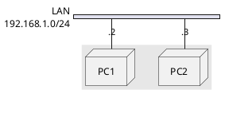

```plantuml
@startuml
nwdiag {

	network LAN{
		address="192.168.1.0/24"
		group {
			PC1[address=".2", shape=node]
			PC2[address=".3", shape=node]
		}
	}

}
@enduml
```


```Shell
R1> en
```

Test