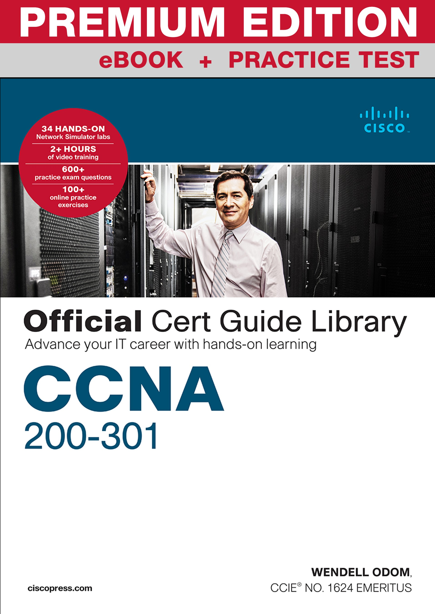
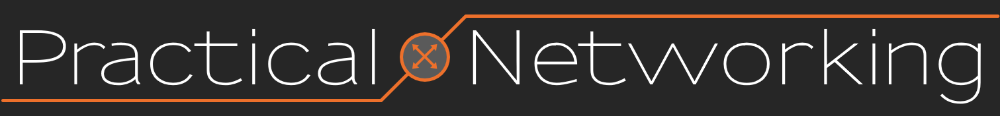
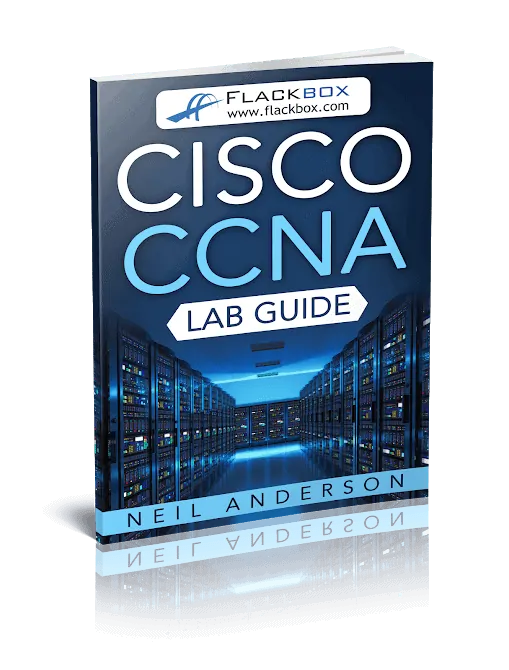
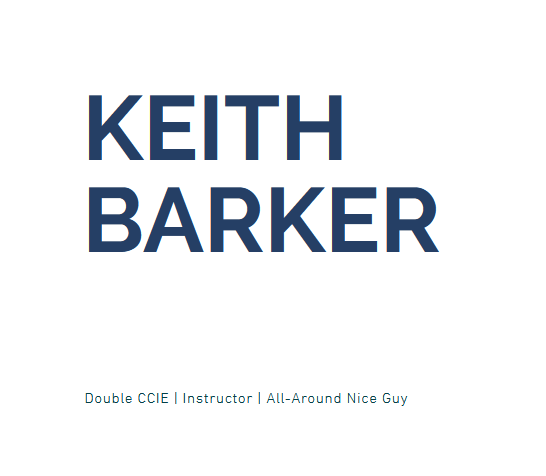

# My JITL CCNA's Notes

## Main Contents:

#### [Free CCNA 200-301 | Complete Course 2023](https://www.youtube.com/playlist?list=PLxbwE86jKRgMpuZuLBivzlM8s2Dk5lXBQ) The main videos being used to make notes.
#### [JeremyITLab Official Website](https://courses.jeremysitlab.com/) His official website.

### Requirements:
* ##### [Pandoc Mermaid-Filter (GitHub)](https://github.com/raghur/mermaid-filter)
	* Used to render Mermaid diagram in pdf/latex.
* ##### Pandoc extension CLI Argument:

```shell
--highlight-style tango --filter mermaid-filter.cmd -V geometry:a4paper,margin=2cm
```

* ##### [PDFLaTex (Installed with TexLive)](https://tug.org/texlive/windows.html#install)

## Extra contents I used/planned on using:


#### [CCNA Official Cert Guide Library via ciscopress.com](https://www.ciscopress.com/store/ccna-200-301-official-cert-guide-library-9781587147142)


#### [Practical Networking by Ed Harmoush](https://www.practicalnetworking.net/)


#### [Neil Anderson's CCNA Lab Guide (Free)](https://www.flackbox.com/cisco-ccna-lab-guide)


#### [Wendell Odom's CertSkills (Official Cert Guide's author)](https://www.certskills.com/)


#### [The Keith Barker's Packet Tracer Lab](https://www.thekeithbarker.com/)

Big thank  you to Jeremy and others for providing easy-to-understand Networking and CCNA knowledge for learners, including me.  

<hr>

